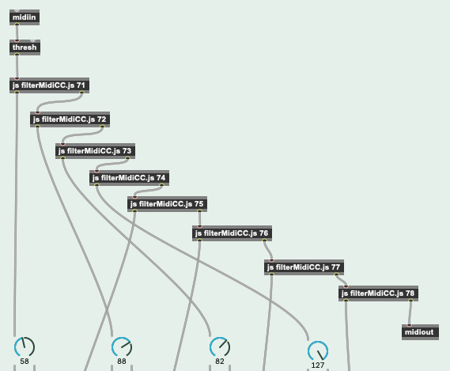

# The Zapperment Max for Live Lib

A library of useful [Max for Live](https://www.ableton.com/live/max-for-live/)
objects, written in [TypeScript](https://www.typescriptlang.org).

## Motivation

The [js object](https://docs.cycling74.com/max8/refpages/js#autowatch) in Max
for Live is a powerful tool to code music software.

However, the JavaScript language version used in the code of js objects is
ECMAScript 5, which is quite old and misses a lot of useful features of modern
JavaScript, like module loading, promises, async/await, let, const, for...of
loops, arrow function, to name just a few.

Wouldn't it be nice to harness all that power when writing code for M4L patcher
**plus** profit from the excellent developer experience and bug safety provided
by [TypeScript](https://www.typescriptlang.org)?

This project makes this possible through a special
[webpack](https://webpack.js.org) build that transpiles TypeScript code of each
js object into a single bundle that is ES5 compatible and can be used directly
in Max for Live.

## Installing and building

### Prerequisites

- Make sure you have the latest version of [Node.js](https://nodejs.org/)
  installed
- Make sure you have the package management tool [Yarn](https://yarnpkg.com)
  installed

### Installation

- Clone this repository to your local file system:

```
git clone git@github.com:zapperment/max-for-live-lib.git
cd max-for-live-lib
```

- Install npm package dependencies with Yarn:

```
yarn
```

### Create a configuration

Create a _.env_ file for configuration. The easiest way to do this is to copy
the file [.env.example](.env.example), which is included in this repository:

```
cp .env.example .env
```

This file can be used to specify the path where your Max for Live patchers are
stored. This way, you can write the compiled TypeScript modules directly to your
M4L directory and have the patcher updated almost instantly.

By default, the compiled files are written to a _dist_ directory below the
repository root. If you don't specify the path to your M4L patcher directory,
you'll have to copy the compiled JavaScript files over manually to use them.

### Build the js objects

To build the JavaScript bundles from the TypeScript sources so that they can be
used in your M4L patcher, run the _build_ script:

```
yarn build
```

## Included js objects

### filterMidiCC

This js object can receive MIDI input and filter out MIDI control change (CC)
messages. If the controller number matches the specified number, the value of
the control change is sent to outlet 1, otherwise the MIDI data is sent through
to outlet 2.



### pickUp

Passes values coming in at inlet 1 on to outlet 2 only if they are at or beyond
a set threshold value. The threshold value is set through inlet 2. This is
useful for MIDI controllers.

### getNextTriggerTime

When this JS object receives a bang, it calculates the musical time in beats that
a clip that has been fired will start playing.

### firedSlotStartOrStop

When this JS object receives an integer value as returned by the slot property
*fired_slot_index*, it determines if that value means a clip will start playing
or the track will stop playing, and issues a bang to outlet 1 or 3, accordingly.

If no slot has been fired, a bang is sent to outlet 2.

### anySlotPlaying

When this JS object receives a bang, it checks if any slot in the device's track
is playing. It sends a number to outlet 1 (0: no slot is playing, otherwise 1).
It also sends a bang to outlet 1 if any slot is playing or a bang to outlet 2
if no slot is playing.

### getDeviceParameters

When this JS object receives the ID of a Live device, it sends a string to
initialize the range arof a *live.menu* object with a message to outlet 1,
a list of parameter names to outlet 2 and a list of IDs of the device 
parameters to outlet 3.


## Developing your own js objects

If you want to develop your own js objects, you probably want the build to
automatically be run again every time you change something in the source files.

To do this, run in watch mode:

```
yarn watch
```
